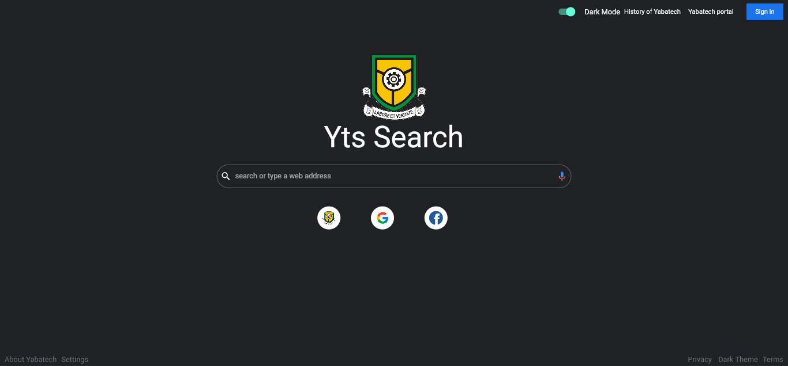

# Designing Your Own Search Engine With Flutter & Firebase
Stay for more update
#Features 

 Light Mode for Web Users
   

 Dark Mode for Web Users
     

# Mobile Users
Coming Soon....
Follow For More Projects

# A School project built with Flutter and Firebase.

# Features
- Users ability to toggle between Dark Theme and Light Theme
- Scalable and Fast
- Available on Android and Web future implementation include Availability to IOS devices
- Ability to Sign In
- Retain History even if their power outage

## Getting Started

This project is a starting point for a Flutter application.

A few resources to get you started if this is your first Flutter project:

- [Lab: Write your first Flutter app](https://docs.flutter.dev/get-started/codelab)
- [Cookbook: Useful Flutter samples](https://docs.flutter.dev/cookbook)

For help getting started with Flutter development, view the
[online documentation](https://docs.flutter.dev/), which offers tutorials,
samples, guidance on mobile development, and a full API reference.
